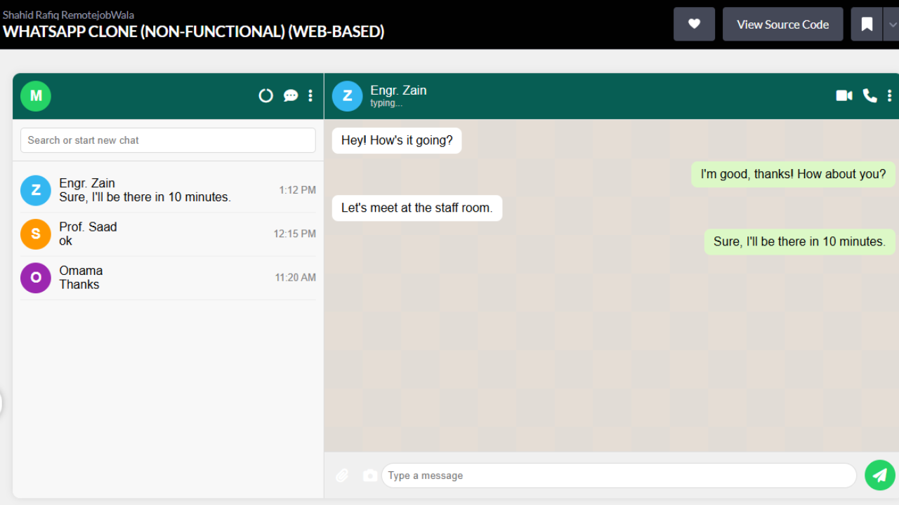

# WhatsApp Clone (Web-Based)

A static, non-functional WhatsApp clone built using **HTML**, **CSS**, and **JavaScript**. This project focuses on creating a visually accurate and responsive chat interface inspired by WhatsApp.

---

## 🚀 **Features**
- **Chat Interface**: A clean and responsive chat layout with a sidebar and chat area.
- **Profile Pictures**: Displays the first letter of the name as a profile picture with dynamic background colors.
- **Engaging Design**: Subtle background patterns and hover effects for a modern look.
- **Send Button**: A fully styled send button with a paper plane icon.
- **Responsive Layout**: Works seamlessly on different screen sizes.

---

## 🛠️ **Technologies Used**
- **HTML**: For structuring the layout.
- **CSS**: For styling and animations.
- **JavaScript**: For basic interactivity (e.g., sending messages).
- **Font Awesome**: For icons (e.g., send button, video call, etc.).

---

## 📸 **Screenshots**

  

---

## 🎯 **How to Use**
1. Clone the repository:
   ```bash
   git clone https://github.com/your-username/whatsapp-clone.git
2. Open the project folder:
   ```bash
   cd whatsapp-clone
3. Open index.html in your browser to view the project.

---

## 🧩 **Project Structure**
whatsapp-clone/
- ├── index.html          # Main HTML file
- ├── styles.css          # CSS for styling
- ├── script.js           # JavaScript for interactivity
- ├── README.md           # Project documentation
- └── assets/             # Folder for images/icons (if any)
---

## 🔧 **Customization**
- Change Names: Update the names in the index.html file.
- Change Colors: Modify the background colors in the .initial class or inline styles.
- Add More Features: Extend the functionality by adding more JavaScript logic.

---

## 🌟 **Contributing**
- Contributions are welcome! If you'd like to contribute:
- Fork the repository.
- Create a new branch (git checkout -b feature/YourFeatureName).
- Commit your changes (git commit -m 'Add some feature').
- Push to the branch (git push origin feature/YourFeatureName).
- Open a pull request.

---

## 📄 **License**
This project is licensed under the MIT License. See the [LICENSE](https://github.com/Shahid-Rafiq-RemotejobWala/WHATSAPP-CLONE-NON-FUNCTIONAL-WEB-BASED-/blob/main/LICENSE) file for details.

---

## 🙏 **Acknowledgments**
- Inspired by WhatsApp.
- Icons provided by Font Awesome.
- Background pattern from Hero Patterns.

---

## 👨‍💻 **Developer**
This project was developed by Shahid Rafiq | RemotejobWala.
- **Email**: [msrafiq310@gmail.com](mailto:msrafiq310@gmail.com)
- **LinkedIn**: [Shahid Rafiq RemotejobWala](https://www.linkedin.com/in/shahid-rafiq-remotejobwala)
- **Facebook**: [Shahid Rafiq RemotejobWala](https://www.facebook.com/profile.php?id=100004719165786)
